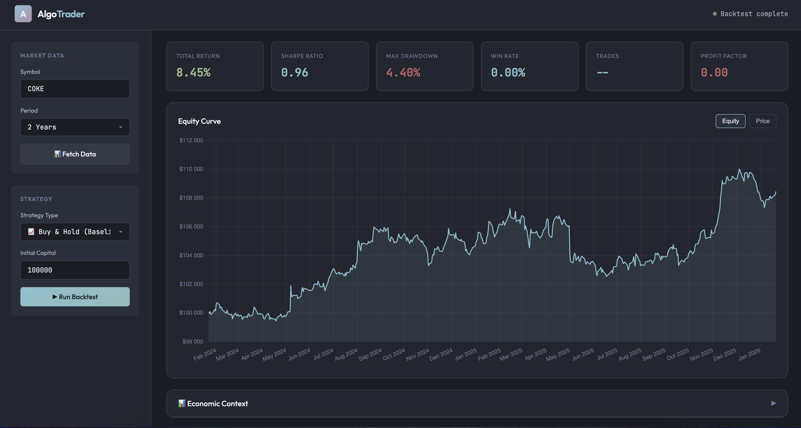
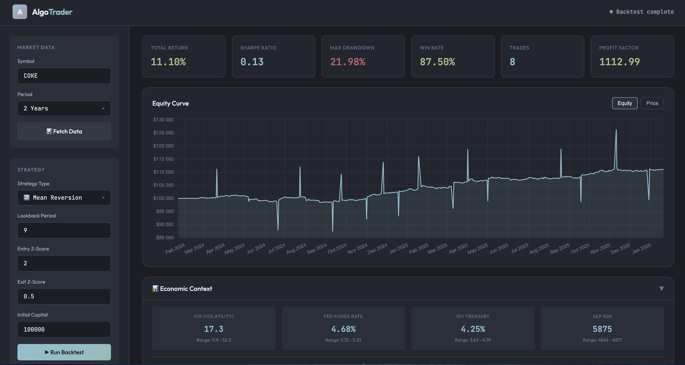
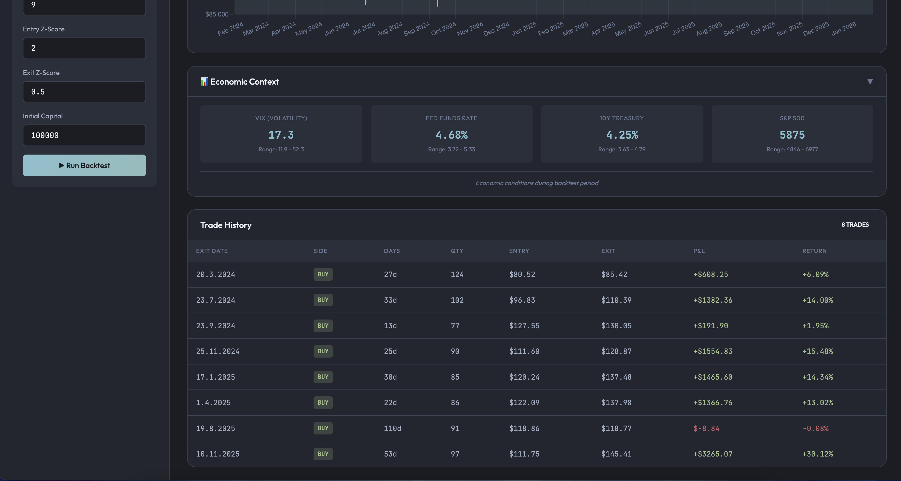

# Algo-Trader

**Algorithmic Trading Analytics Platform** built with kdb+/q and Python.

A modular platform for developing, backtesting, and analyzing algorithmic trading strategies. Focuses on high-performance time-series analytics using kdb+/q with Python for data fetching and complex algorithms.


---

## Introduction

Technical analysis is considered to be the study of historical market data, primarily price and volume, to forecast future price movements<sup>1,2,3,4</sup>. It goes againt _the efficient market hypothesis_ which states that all known information is already reflected in prices. Technical analysts and quants believe that price movements are not entirely random and that correlations, patterns, trends, and indicators can provide insights into future price action.

Algorithmic trading utilizes computer algorithms to take advantage of small market inefficiencies (like _ask/bid spread_ or _book vs market value_) and to execute trades based on predefined criteria<sup>5,6</sup>. It allows traders to capitalize on market opportunities with speed, precision and consistency that human traders cannot match.

In the long rung the average expected return on wealth (r) is  around ~6% and the growth (or return) of economy (g) is around ~3% <sup>7,8</sup>. So, in the long run you should be a banker and not an economist. Sadly, and rather disappointingly, in the long run we are all dead. All in all, if your trading strategies on average return less than ~6%, you probably shouldn’t quit your day job.


---

## Features

- 📊 **Backtesting Engine** — Event-driven backtesting framework with realistic execution simulation
- 📈 **Technical Indicators** — Comprehensive library of indicators (SMA, EMA, RSI, MACD, Bollinger Bands, etc.)
- 🎯 **Strategy Library** — Pre-built strategies (Momentum, Mean Reversion, RSI, Bollinger Bands)
- ⚡ **kdb+/q Analytics** — High-performance time-series operations
- 🌐 **REST API** — FastAPI server for programmatic access
- 💻 **Web Dashboard** — Minimal, effective UI for strategy analysis
- 🔄 **Data Feeds** — Yahoo Finance integration (extensible to other sources)

---

## Quick Start

### Prerequisites

- Python 3.10+
- kdb+/q (KDB-X Community Edition)
- PyKX

### Installation

1. **Clone the repository**
```bash
git clone https://github.com/yourusername/algo-trader.git
cd algo-trader
```

2. **Create virtual environment**
```bash
python -m venv venv
source venv/bin/activate  # On Windows: venv\Scripts\activate
```

3. **Install dependencies**
```bash
pip install -r requirements.txt
```

4. **Configure environment**
```bash
cp config/.env.example config/.env
# Edit config/.env with your API keys
```

### Running the Application

**Start the API server:**
```bash
# Using script
./scripts/start_api.sh

# Or manually
export PYTHONPATH=$PYTHONPATH:$(pwd)/src
uvicorn src.python.api.server:app --reload --port 8000
```

**Open the dashboard:**
Open `src/ui/index.html` in your browser, or serve it:
```bash
python -m http.server 3000 --directory src/ui
```

Navigate to `http://localhost:3000`

**NOTE**: Add a file `./config/API_KEYS.txt` with your API keys if needed. Currently only FRED API key is required for economic data.

---

## Architecture

```
┌─────────────────────────────────────────────────────────────┐
│                        Web Dashboard                        │
└──────────────────────────────┬──────────────────────────────┘
                               │
┌──────────────────────────────▼──────────────────────────────┐
│                      FastAPI Server                         │
│              REST API + WebSocket endpoints                 │
└──────────────────────────────┬──────────────────────────────┘
                               │
        ┌──────────────────────┼──────────────────────┐
        │                      │                      │
┌───────▼───────┐    ┌─────────▼────────┐   ┌────────▼────────┐
│   Backtest    │    │    Analytics     │   │   Strategies    │
│    Engine     │    │     Library      │   │                 │
└───────────────┘    └──────────────────┘   └─────────────────┘
                               │
┌──────────────────────────────▼──────────────────────────────┐
│                       Data Layer                            │
│            kdb+/q (HDB) + Python (feedhandlers)             │
└─────────────────────────────────────────────────────────────┘
```

---

## Project Structure

```
algo-trader/
├── src/
│   ├── python/
│   │   ├── api/              # FastAPI server
│   │   ├── backtest/         # Backtesting engine
│   │   ├── feedhandlers/     # Data source connectors
│   │   ├── strategies/       # Trading strategies
│   │   └── utils/            # Utilities (PyKX bridge)
│   │
│   ├── q/
│   │   └── analytics/        # kdb+/q analytics
│   │       ├── indicators.q  # Technical indicators
│   │       └── performance.q # Performance metrics
│   │
│   └── ui/                   # Web dashboard
│
├── config/                   # Configuration files
├── scripts/                  # Startup scripts
├── data/                     # Data storage (HDB, RDB)
├── examples/                 # Example usage scripts 
├── tickers/                  # Ticker lists
├── freezer/                  # Development sketches
└── notes/                    # Project documentation
```

---

## Usage Examples

### Python Backtesting

```python
from src.python.feedhandlers import YFinanceFeed
from src.python.backtest import BacktestEngine, BacktestConfig
from src.python.strategies import MomentumStrategy

# Fetch data
feed = YFinanceFeed()
data = feed.get_ohlcv('AAPL', interval='1d')

# Configure backtest
config = BacktestConfig(
    initial_capital=100000,
    commission=0.001,
    slippage=0.0005
)

# Create strategy
strategy = MomentumStrategy(fast_period=10, slow_period=30)

# Run backtest
engine = BacktestEngine(config)
engine.load_data(data)
engine.set_strategy(strategy)
results = engine.run()

print(f"Total Return: {results['metrics']['total_return']:.2%}")
print(f"Sharpe Ratio: {results['metrics']['sharpe_ratio']:.2f}")
print(f"Max Drawdown: {results['metrics']['max_drawdown']:.2%}")
```

### kdb+/q Analytics

```q
/ Load indicators
\l src/q/analytics/indicators.q

/ Calculate technical indicators
prices: 100 + sums 100?1.0 - 0.5  / Random walk

sma20: sma[20; prices]           / 20-period SMA
rsi14: rsi[14; prices]           / 14-period RSI
bb: bollinger[20; 2; prices]     / Bollinger Bands

/ Performance metrics
\l src/q/analytics/performance.q

returns: .perf.returns[prices]
summary: .perf.summary[returns; 0.02; 252]  / 2% rf rate, daily data
```

### API Endpoints

```bash
# Get quote
curl http://localhost:8000/api/quote/AAPL

# Get OHLCV data
curl "http://localhost:8000/api/ohlcv/AAPL?period=1y&interval=1d"

# Run backtest
curl -X POST http://localhost:8000/api/backtest \
  -H "Content-Type: application/json" \
  -d '{
    "symbol": "AAPL",
    "strategy": "momentum",
    "period": "1y",
    "initial_capital": 100000,
    "params": {"fast_period": 10, "slow_period": 30}
  }'
```

---

## Available Strategies

| Strategy | Type | Description | Parameters |
|----------|------|-------------|------------|
| **Buy & Hold** | Baseline | Buy at start, hold until end (benchmark) | None |
| **Momentum** | Trend | Dual MA crossover | `fast_period`, `slow_period`, `ma_type` |
| **MACD** | Trend | MACD line crossing signal line | `fast_period`, `slow_period`, `signal_period` |
| **RSI** | Mean Reversion | Overbought/oversold reversals | `period`, `oversold`, `overbought` |
| **Trend Following** | Trend | Multi-timeframe MA filter | `short_period`, `medium_period`, `long_period` |
| **Bollinger Bands** | Mean Reversion | Trade on band touches | `period`, `std_dev` |
| **Mean Reversion** | Mean Reversion | Z-score based reversion | `lookback`, `z_threshold`, `exit_threshold` |
| **Pairs Trading** | Statistical Arb | Spread z-score trading | `lookback`, `entry_z`, `exit_z` |

> 📖 See [TRADING_STRATEGIES.md](src/python/strategies/TRADING_STRATEGIES.md) for detailed strategy documentation.

---

## Technical Indicators (kdb+/q)

### Moving Averages
- `sma[n;x]` — Simple Moving Average
- `ema[n;x]` — Exponential Moving Average
- `wma[n;x]` — Weighted Moving Average
- `dema[n;x]` — Double EMA
- `tema[n;x]` — Triple EMA

### Momentum
- `rsi[n;x]` — Relative Strength Index
- `macd[x;fast;slow;sig]` — MACD
- `stochastic[n;k;d;h;l;c]` — Stochastic Oscillator
- `roc[n;x]` — Rate of Change
- `momentum[n;x]` — Momentum

### Volatility
- `bollinger[n;k;x]` — Bollinger Bands
- `atr[n;h;l;c]` — Average True Range
- `hvol[n;periods;x]` — Historical Volatility

### Trend
- `adx[n;h;l;c]` — Average Directional Index
- `psar[af;maxAf;h;l]` — Parabolic SAR

---

## Performance Metrics

**Dashboard Metrics (UI):**

| Metric | Description |
|--------|-------------|
| Total Return | Cumulative return over the backtest period |
| Sharpe Ratio | Risk-adjusted return (higher = better risk/reward) |
| Max Drawdown | Largest peak-to-trough decline (risk measure) |
| Win Rate | Percentage of profitable trades |
| Trades | Total number of round-trip trades |
| Profit Factor | Gross profit / Gross loss (>1 = profitable) |

**Additional Metrics (available in code):**

| Metric | Description |
|--------|-------------|
| Annualized Return | CAGR adjusted for time |
| Sortino Ratio | Downside risk-adjusted return |
| Calmar Ratio | Return / Max Drawdown |
| VaR (95%) | Value at Risk at 95% confidence |
| Expectancy | Expected value per trade |

---

## Interpreting Backtest Results

The web dashboard displays several visualizations and data tables. Here's how to interpret them:

### Price Data

All strategies use **daily close prices** for:
- **Signal generation** — Indicators (SMA, RSI, etc.) are calculated on close prices
- **Order execution** — Market orders fill at the close price (with optional slippage)
- **P&L calculation** — Unrealized and realized P&L based on close prices

### Equity Curve

The equity curve shows your portfolio value over time:

- **Smooth sections** — Cash only (no position held)
- **Volatile sections** — Active position with daily P&L fluctuations
- **Upward/downward swings** — Daily price movements affecting unrealized P&L

> The "spikes" you see are real — they show the volatility of holding positions. A large daily price movement creates a large swing in portfolio value.

### Trade History

The trade table shows **completed round-trip trades** (enter → exit):

| Column | Description |
|--------|-------------|
| Exit Date | When the position was closed |
| Side | Direction of entry (BUY = long position) |
| Days | Holding period in trading days |
| Qty | Number of shares traded |
| Entry | Average entry price |
| Exit | Exit/close price |
| P&L | Profit or loss in dollars |
| Return | Percentage return on the trade |

**Note:** The trade list is paginated (15 per page). Use the pagination controls to view all trades.

### Economic Context

When available, FRED data shows economic conditions during your backtest period:

| Indicator | Relevance |
|-----------|-----------|
| VIX | Market volatility/fear gauge |
| Fed Funds Rate | Monetary policy environment |
| 10Y Treasury | Interest rate environment |
| S&P 500 | Broad market performance |

These help contextualize your strategy's performance (e.g., did it work during high volatility?).

### Holding Periods

Strategies determine their own holding periods based on signals:

- **Buy & Hold** — Holds entire period (one trade)
- **Momentum/MACD** — Holds until signal reversal (days to weeks)
- **RSI/Bollinger** — Mean reversion, typically shorter holds
- **Trend Following** — Can hold for extended periods in strong trends

The "Days" column in Trade History shows actual holding duration per trade.

---

## UI

Default Buy-and-Hold vs Mean Reversion strategy on COKE ticker (2yrs period): 8.45% vs 11.10% total return.





---

## Data Sources

| Source | Type | Status |
|--------|------|--------|
| Yahoo Finance | Historical OHLCV, Quotes | ✅ Implemented |
| FRED | Economic Data | ✅ Implemented |
| EOD Data | EOD Prices | 🔧 Planned |
| Alpha Vantage (or other) | Real-time Data | 🔧 Planned |

---

## Current Architecture

The app currently runs as **pure Python** for simplicity and rapid development:

| Component | Implementation | Notes |
|-----------|----------------|-------|
| Data Fetching | Python (yfinance) | ✅ Working |
| Backtesting | Python | ✅ Working |
| Strategies | Python | ✅ Working |
| API Server | Python (FastAPI) | ✅ Working |
| Web UI | HTML/JS | ✅ Working |
| kdb+/q Analytics | q scripts (ready) | 🔧 Not yet integrated |
| PyKX Bridge | Python (ready) | 🔧 Not yet integrated |

**kdb+/q Integration Roadmap:**
- Store historical data in HDB for fast queries
- Use q analytics for large-scale indicator calculations
- Ticker plant for real-time data streaming
- PyKX for Python ↔ kdb+ communication

---

## Roadmap

- [x] Core backtesting engine
- [x] Technical indicators library (Python + q)
- [x] 8 trading strategies
- [x] REST API
- [x] Web dashboard
- [x] FRED economic data integration
- [ ] kdb+/q data storage integration
- [ ] Monte Carlo simulation
- [ ] Walk-forward optimization
- [ ] Portfolio-level backtesting
- [ ] Paper trading simulation
- [ ] Broker integration for live trading (Alpaca, IBKR)
- [ ]  Bug Fixing?

---

## License

This project is licensed under the MIT License - see the [LICENSE](LICENSE) file for details.

---

## Acknowledgments

- [kdb+/q](https://code.kx.com/) by KX Systems
- [yfinance](https://github.com/ranaroussi/yfinance) by Ran Aroussi
- [PyKX](https://code.kx.com/pykx/) for Python-kdb+ integration

## References
<sup>1</sup> Andrew Lo & Jasmina Hasanhodzic, **The Evolution of Technical Analysis: Financial Prediction from Babylonian Tablets to Bloomberg Terminals**, (2010), Bloomberg Press
<sup>2</sup> John J. Murphy, **Technical Analysis of the Financial Markets**, (1999), New York Institute of Finance
<sup>3</sup> George Szpiro, **Pricing the Future: Finance, Physics, and the 300-year Journey to the Black-Scholes Equation**, (2011), Basic Books
<sup>4</sup> Burton G. Malkiel, **A Random Walk Down Wall Street**, (1973), W.W. Norton & Company
<sup>5</sup> Ernest P. Chan, **Algorithmic Trading: Winning Strategies and Their Rationale**, (2013), Wiley
<sup>6</sup> Marcos Lopez de Prado, **Advances in Financial Machine Learning**, (2018), Wiley
<sup>7</sup> Thomas Piketty, **Capital in the Twenty-First Century**, (2014), Harvard University Press
<sup>8</sup> Oscar Jordà et al., **The Rate of Return on Everything, 1870–2015**, The Quarterly Journal of Economics, Volume 134, Issue 3, August 2019, Pages 1225-1298, https://doi.org/10.1093/qje/qjz012
